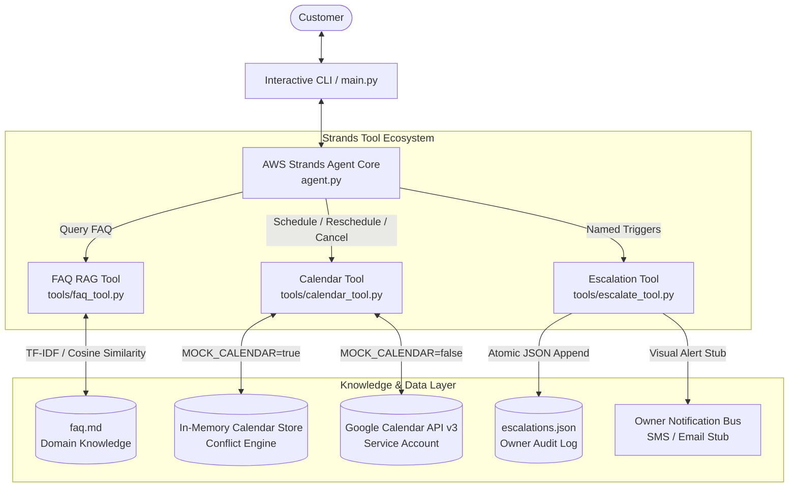
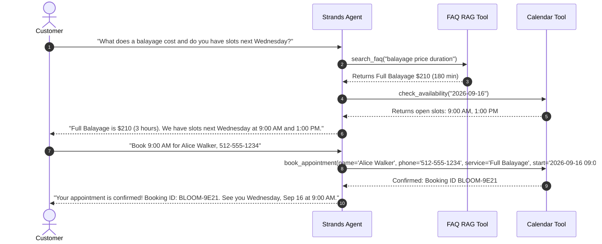

# Architecture Specification — shopfront-agent

## Overview
**shopfront-agent** is an autonomous booking, intake, and customer care agent designed for **Bloom Hair Studio** (a boutique salon in Austin, TX). Built on the **AWS Strands Agents SDK** for the AWS "Agents for Humans" Hackathon (Professional Agents track), the system operates on an **autonomy-first paradigm**: routine scheduling, cancellations, and inquiries are handled entirely without human intervention, while ambiguous edge cases, complaints, and refund requests are escalated cleanly to salon owner Sarah Lin.

---

## 1. System Architecture



---

## 2. Core Components

### 2.1 Strands Agent Core (`agent.py`)
- **Framework**: AWS Strands Agents SDK (`strands-agents`).
- **Pattern**: Pure Agent + Tools model-driven loop.
- **Model Routing**: Multi-provider configuration supporting OpenRouter (`OpenAIModel` with `openai/gpt-4o-mini`), direct OpenAI (`OpenAIModel`), and native Amazon Bedrock (`BedrockModel`).
- **System Prompt Directives**:
  - Establishes identity as Bloom, salon concierge for Sarah Lin.
  - Implements **Autonomy First**: Executes slot booking and lookups immediately rather than passively asking "Should I do this?".
  - Defines crisp boundaries for escalation versus autonomous resolution.

### 2.2 Local FAQ RAG Tool (`tools/faq_tool.py`)
- **Data Source**: `faq.md` containing studio hours, services, pricing, cancellation fees, refund adjustments, and parking rules.
- **Engine**: Lightweight TF-IDF vectorizer and cosine similarity calculation.
- **Design Advantage**:
  - Zero external vector database dependency (no Pinecone, Chroma, or remote embeddings required).
  - Installs instantly and executes in under 2 milliseconds.
  - Title token boosting and stop-word filtering ensure pinpoint accuracy on salon inquiries.

### 2.3 Calendar Scheduling Tool (`tools/calendar_tool.py`)
- **Dual-Engine Architecture**:
  - **In-Memory Mock Store (`MOCK_CALENDAR=true`)**: Deterministic scheduling engine pre-seeded with existing appointments, enforcing salon operating hours (Tue-Sat 9am-6pm) and blocking double-bookings. Every response carries a clear `[MOCK CALENDAR]` label.
  - **Google Calendar API (`MOCK_CALENDAR=false`)**: Production-ready connector using Google Service Account OAuth credentials to manage primary Google Calendar events.
- **Capabilities**:
  - `check_availability(date)`: Calculates open slots against existing bookings.
  - `book_appointment(...)`: Validates business hours, checks duration, blocks overlapping slots, generates a `BLOOM-XXXX` booking reference.
  - `reschedule_appointment(...)`: Reallocates slots atomically.
  - `cancel_appointment(...)`: Cancels bookings and reminds client of 24-hour policy.

### 2.4 Escalation Engine (`tools/escalate_tool.py`)
- **Function**: `escalate_to_owner(...)`
- **Output**: Writes structured record to `escalations.json` and renders a prominent terminal alert simulating an owner SMS/Email notification.
- **Workflow**: Assigns a tracked ticket ID (`ESC-YYYYMMDD-XXXX`), informs the customer that owner Sarah Lin will personally reach out within 2 to 4 business hours, and cleanly concludes the interaction without deadlocking.

---

## 3. Decision Flows & Autonomy Matrix

### 3.1 Autonomy Matrix

| Customer Intent | Autonomous Handling | Human Escalation | Action Taken |
| :--- | :---: | :---: | :--- |
| Inquire about prices or service duration | **Yes** | No | `search_faq` retrieves exact menu and prices |
| Check open booking slots | **Yes** | No | `check_availability` returns open appointment windows |
| Book routine haircut, blowout, or color | **Yes** | No | `book_appointment` creates confirmed reservation |
| Reschedule with >24h notice | **Yes** | No | `reschedule_appointment` moves booking |
| Standard cancellation | **Yes** | No | `cancel_appointment` records status and policy |
| Request cash refund for past service | No | **Yes** | `escalate_to_owner` (Trigger: `refund_request`) |
| Complaint about bad haircut or damaged hair | No | **Yes** | `escalate_to_owner` (Trigger: `service_complaint`) |
| Demanding off-hours appointment (Sunday/evening) | No | **Yes** | `escalate_to_owner` (Trigger: `policy_exception`) |
| Unresolvable double-booking or emergency VIP | No | **Yes** | `escalate_to_owner` (Trigger: `scheduling_conflict`) |

---

### 3.2 Sequence Flow: Autonomous Booking



---

### 3.3 Sequence Flow: Owner Escalation

```mermaid
sequenceDiagram
    autonumber
    actor Client as Customer
    participant Agent as Strands Agent
    participant FAQ as FAQ RAG Tool
    participant Esc as Escalation Tool
    participant Owner as Owner Sarah Lin

    Client->>Agent: "I got a color treatment yesterday and it looks orange. I want my money back immediately!"
    Agent->>FAQ: search_faq("refund policy")
    FAQ-->>Agent: "No monetary refunds; 48-hr complimentary adjustment by owner."
    Note over Agent: Evaluates Escalate vs. Handle:<br/>Detects Named Trigger: refund_request & service_complaint
    Agent->>Esc: escalate_to_owner(name='Client', trigger='refund_request', reason='Unhappy with color, demanding refund')
    Esc->>Esc: Record Ticket ESC-20260912-7A1B to escalations.json
    Esc-->>Owner: Dispatch alert notification to Sarah Lin
    Esc-->>Agent: Escalation Ticket logged successfully
    Agent-->>Client: "I understand your frustration with your color. Our studio owner, Sarah Lin, personally handles all service concerns. I have logged ticket ESC-20260912-7A1B and Sarah will reach out to you directly within 2-4 business hours to arrange a complimentary adjustment."
```

---

## 4. Data Contracts

### 4.1 Calendar Event Schema (In-Memory / Google API)
```json
{
  "id": "BLOOM-C3D4E5",
  "customer_name": "Alice Walker",
  "customer_phone": "512-555-1234",
  "service": "Signature Haircut & Blowdry",
  "start": "2026-09-15T10:00:00",
  "end": "2026-09-15T11:00:00",
  "duration_minutes": 60,
  "notes": "First visit",
  "status": "confirmed"
}
```

### 4.2 Escalation Record Schema (`escalations.json`)
```json
{
  "ticket_id": "ESC-20260912-678E",
  "timestamp": "2026-09-12T23:13:54.123456",
  "customer_name": "Sarah Connor",
  "customer_contact": "512-555-9999",
  "trigger_category": "refund_request",
  "reason": "Unhappy with hair color tone, demanding cash refund",
  "conversation_summary": "Customer had balayage yesterday and wants money back.",
  "urgency": "high",
  "status": "pending_owner_review"
}
```
